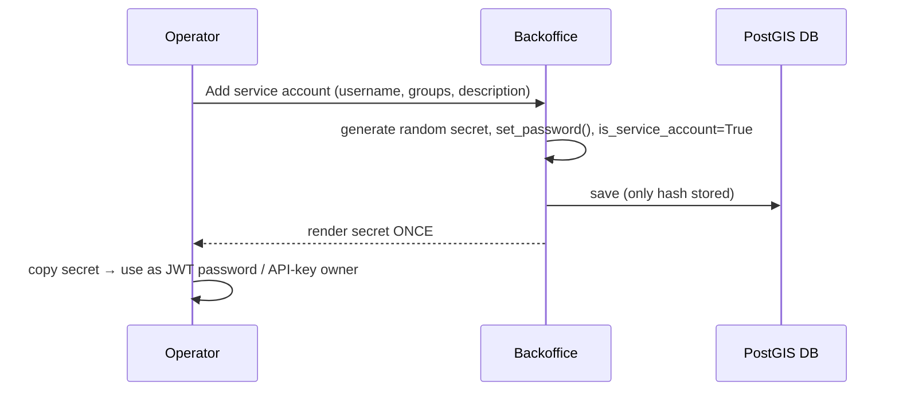

# Admin backoffice

The human backoffice for the terminschleuder API. It is a custom Django `AdminSite`
(`terminschleuder_admin`, in the [`admin` app](../admin/)) mounted at the **root (`/`)**, so
operators don't have to remember an `/admin/` prefix.

## Getting in

- Browse to **`http://localhost:8000/`**. Anonymous visitors redirect to `/login/`.
- Log in with a **staff** user. Create one the first time:

  ```bash
  docker compose exec web python manage.py createsuperuser
  ```

  (Superusers are staff.) The backoffice uses **Django session auth on the project's custom
  `User`** — the same user model the API authenticates — so there is no separate auth system.
  `/admin/` redirects to `/` for old bookmarks.

## What it manages

| Section | What you do there |
| ------- | ----------------- |
| **Users** | Create/manage human users. Set `is_staff` to grant backoffice access; assign groups. Passwords hashed via Django's forms. |
| **Service accounts** | A dedicated, pre-filtered list (a proxy of `User`). Create one → an **app secret is generated and shown once**; `is_service_account` is forced on, `is_staff` off. "Regenerate app secret" re-rolls it. |
| **Groups** | Maintain Django groups & permissions. Groups drive event `owner_group` and service-account powers (see [Authentication](authentication.md)). |
| **API keys** | Issue a long-lived key → the **raw key is shown once** (only prefix + sha256 hash stored). Revoke by editing `revoked`. Raw keys are never listed. |
| **Cities** | Maintain the gazetteer: add/edit, toggle `is_active`. Bulk re-seed is still the `seed_cities` command (it touches 2131 rows). See [Geospatial & cities](geospatial.md). |
| **Events** | Full CRUD. New events default `created_by` to the operator; `created_at`/`updated_at` are read-only. `venue`/`organizer` use autocomplete; `categories` is a filter-horizontal widget. |
| **Venues / Organizers / Categories** | Full CRUD. `location` is edited via the PostGIS map widget (works inside the container). |

## Service-account & API-key "shown once" flow

Both secrets follow the same pattern as `APIKey.create`: a random value is generated, only a
hash (or, for service accounts, a Django-hashed password) is stored, and the **raw value is
rendered on a one-off page** immediately after creation — copy it then, it is not retrievable
later. For service accounts that value is the password used to obtain a JWT (`POST
/api/auth/token/`); for API keys it is the `Authorization: Api-Key <raw-key>` value.



## How it's wired (for maintainers)

- `admin/admin_site.py` — `TerminschleuderAdminSite` instance `terminschleuder_admin`. Its
  `name` stays the default `"admin"` so the built-in admin templates (which hardcode the
  `admin:` URL namespace) keep working.
- `admin/admin.py` — the **single registry**: imports the per-app `ModelAdmin` classes
  (defined in `accounts/admin.py`, `events/admin.py`, `locations/admin.py`) and registers
  them on `terminschleuder_admin`, plus the custom `ServiceAccountAdmin`, `APIKeyAdmin`,
  `EventAdminEnhanced`, `CityAdminEnhanced`, and `GroupAdmin`.
- `admin/models.py` — the `ServiceAccount` **proxy** of `User` (no DB table) with a manager
  filtering `is_service_account=True`, giving service accounts their own backoffice section.
- `admin/apps.py` — `AdminConfig` with `label = "backoffice"` (the package is named `admin`,
  so the label is overridden to avoid clashing with `django.contrib.admin`'s `admin` label).
  `ready()` imports `admin.admin` because custom `AdminSite`s are **not** auto-discovered.
- `config/urls.py` — the three `api/...` includes are listed **above**
  `path("", terminschleuder_admin.urls)` so the admin catch-all never shadows the API.

> **Gotcha:** because the per-app `admin.py` files no longer use `@admin.register(...)`,
> registration happens **only** in `admin/admin.py`. If you add a model, register it there on
> `terminschleuder_admin` — not with a decorator.