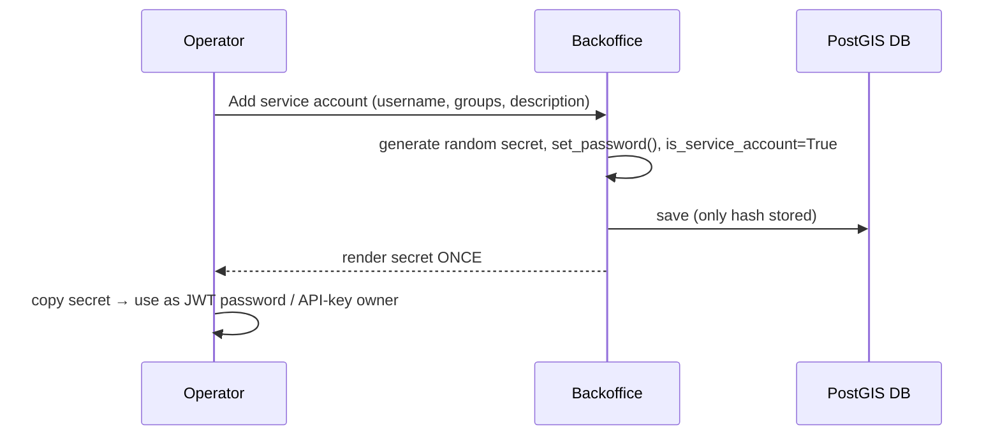

# Admin backoffice

The human backoffice for the terminschleuder API. It is a custom Django `AdminSite`
(`terminschleuder_admin`, in the [`admin` app](../admin/)) mounted at **`/admin/`**. The
site root (`/`) is a public marketing landing page.

## Getting in

- Browse to **`http://localhost:8000/admin/`**. Anonymous visitors redirect to
  `/admin/login/`.
- Log in with a **staff** user. Create one the first time:

  ```bash
  docker compose exec web python manage.py createsuperuser
  ```

  (Superusers are staff.) The backoffice uses **Django session auth on the project's custom
  `User`** — the same user model the API authenticates — so there is no separate auth system.

## What it manages

| Section | What you do there |
| ------- | ----------------- |
| **Users** | Create/manage human users. Set `is_staff` to grant backoffice access; assign groups. Passwords hashed via Django's forms. |
| **Service accounts** | A dedicated, pre-filtered list (a proxy of `User`). Create one → an **app secret is generated and shown once**; `is_service_account` is forced on, `is_staff` off. "Regenerate app secret" re-rolls it. Provision the extractor here (put it in the `ingestion` group). |
| **Groups** | Maintain Django groups & permissions. Groups drive event `owner_group`, service-account powers, and the `ingestion` group (see [Authentication](authentication.md)). |
| **API keys** | Issue a long-lived key → the **raw key is shown once** (only prefix + sha256 hash stored). Revoke by editing `revoked`. Raw keys are never listed. Issue the extractor its key here. |
| **Cities** | Maintain the gazetteer: add/edit, toggle `is_active`. The list shows read-only `latitude`/`longitude` columns (derived from the `location` point); `location` itself is edited via the PostGIS map widget (works inside the container, like venues). Bulk re-seed is still the `seed_cities` command (it touches 2131 rows). See [Geospatial & cities](geospatial.md). |
| **Organizations** | The entities that own event sources and the events extracted from them (renamed from *Organizers*). Add/edit `name`/`description`/`website`/`owner`; the `slug` is auto-generated. Toggle `is_active` — inactive orgs are hidden from the public API and their sources stop being due. |
| **Event sources** | Add a source URL per organization (unique per org), set its `platform`, `fetch_interval_minutes`, and `created_by` (defaults to the operator). **Approve** a source to make it eligible for extraction, **disable** to pause an approved one, **revoke** to withdraw approval. `last_fetched_at`/`next_due_at` are read-only (stamped by the extractor). |
| **Ingestion runs** | **Read-only** — runs are *reported* by the extractor, not edited. Inspect `status`/`started_at`/`finished_at`/`events_found`/`events_promoted`/`error_message`; filter by status or organization. |
| **Event observations** | Review untrusted extracted events. List shows `title`/`starts_at`/`source`/`status`/`attendance_mode`/`event_type`/`reviewed_by`. Actions: **accept**, **reject**, and **promote** (see below). |
| **Events** | Full CRUD + lifecycle. The list shows `status`/`event_type`/`attendance_mode`/`organization`/read-only `latitude`/`longitude`; `location` is edited via the PostGIS map widget. New events default `created_by` to the operator. `venue`/`organization` use autocomplete; `categories` is filter-horizontal. Lifecycle actions: **publish** / **cancel** / **archive** / **revert to draft**. |
| **Venues / Categories** | Full CRUD. Venues show read-only `latitude`/`longitude` columns and edit `location` via the PostGIS map widget (works inside the container). |

## Event observations & promotion

The ingestion pipeline's trust boundary lives here. An **EventObservation** is untrusted; it
never mutates a canonical `Event` directly. An operator reviews it and **promotes** an
accepted one into a canonical event:

1. **Accept / reject** — set an observation to `accepted` or `rejected` (stamps
   `reviewed_by` / `reviewed_at`). Only `pending` observations can be accepted/rejected.
2. **Promote** — the key action (requires `events.add_event`). For a selected non-promoted
   observation it creates a **draft** `Event` copying `title`/`description`/`starts_at`/
   `ends_at`/`attendance_mode`/`event_type`/`location`, with full provenance:
   - `organization` = the source's organization,
   - `source` = the observation's `EventSource`,
   - `promoted_from` = the observation,
   - `original_url` / `original_platform` copied from the observation,
   - `status = draft`, `created_by` = the operator.
   - If the observation has a `venue_name`, a `Venue` is auto-created (or reused) from
     `venue_name`/`venue_address`/`venue_city`.

   The observation is then marked `promoted` (with `reviewed_by`/`reviewed_at`), and its
   run's `events_promoted` counter is bumped. The new event goes **draft → publish** as a
   second, deliberate step.

> The extractor (the `ingestion` service account) **cannot** promote — it lacks
> `add_event`/`change_eventobservation`. Promotion is an operator decision, by design.

## Event lifecycle

An event moves through `draft` → `published` → (`cancelled` | `archived`), reversible to
`draft`. Drive it from the backoffice list actions or the matching API actions
(`POST /api/events/<id>/publish/` etc.):

| Action | Effect |
| --- | --- |
| **Publish** | `status=published`, stamps `published_at`. |
| **Cancel** | `status=cancelled`, stamps `cancelled_at`. |
| **Archive** | `status=archived`. |
| **Revert to draft** | `status=draft`. |

Only `published` events are visible to anonymous users of the public API; an owner may
retrieve their own draft.

## Service-account & API-key "shown once" flow

Both secrets follow the same pattern as `APIKey.create`: a random value is generated, only a
hash (or, for service accounts, a Django-hashed password) is stored, and the **raw value is
rendered on a one-off page** immediately after creation — copy it then, it is not retrievable
later. For service accounts that value is the password used to obtain a JWT (`POST
/api/auth/token/`); for API keys it is the `Authorization: Api-Key <raw-key>` value.



## How it's wired (for maintainers)

- `admin/admin_site.py` — `TerminschleuderAdminSite` instance `terminschleuder_admin`. Its
  `name` stays the default `"admin"` so the built-in admin templates (which hardcode the
  `admin:` URL namespace) keep working.
- `admin/admin.py` — the **single registry**: imports the per-app `ModelAdmin` classes
  (defined in `accounts/admin.py`, `events/admin.py`, `locations/admin.py`) and registers
  them on `terminschleuder_admin`, plus the custom `ServiceAccountAdmin`, `APIKeyAdmin`,
  `EventAdminEnhanced`, `CityAdminEnhanced`, and `GroupAdmin`.
- `admin/models.py` — the `ServiceAccount` **proxy** of `User` (no DB table) with a manager
  filtering `is_service_account=True`, giving service accounts their own backoffice section.
- `admin/apps.py` — `AdminConfig` with `label = "backoffice"` (the package is named `admin`,
  so the label is overridden to avoid clashing with `django.contrib.admin`'s `admin` label).
  `ready()` imports `admin.admin` because custom `AdminSite`s are **not** auto-discovered.
- `config/urls.py` — the backoffice is mounted at `path("admin/", terminschleuder_admin.urls)`.
  The admin's built-in catch-all is therefore confined to `/admin/...` and cannot shadow
  `/media/...` (served above it under `DEBUG`) or the API. The site root (`/`) is a public
  `TemplateView` landing page.

> **Gotcha:** because the per-app `admin.py` files no longer use `@admin.register(...)`,
> registration happens **only** in `admin/admin.py`. If you add a model, register it there on
> `terminschleuder_admin` — not with a decorator.