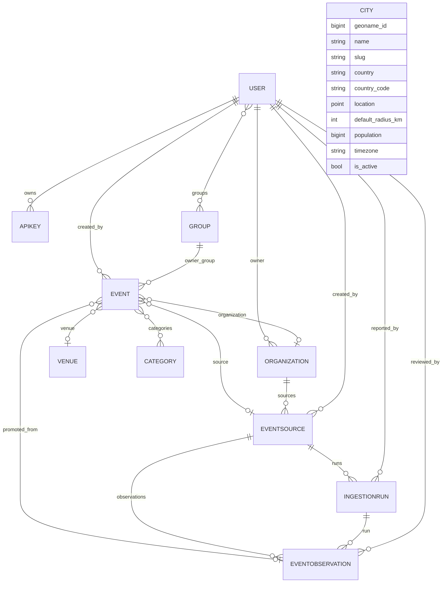

# Data model

The core domain is **canonical events** that happen at **venues**, are owned by
**organizations**, and are tagged with **categories**. Events and venues carry a
**geographic location** (PostGIS `Point`). An **ingestion pipeline** lets external
extractors submit **untrusted event observations** against an organization's **event
sources** (URLs); operators review observations and **promote** accepted ones into canonical
events with full **provenance**. A **city** gazetteer supports location-based discovery, and
**users** / **API keys** handle authentication and ownership.

The trust boundary is central: `Event` is the trusted, published record; `EventObservation`
is untrusted and never mutates an `Event` directly — an operator promotes an accepted
observation into a draft event (linked back via `Event.promoted_from`), which is then
published.

## Entity-relationship diagram

> `City` is independent of the event graph — it is a gazetteer used to resolve
> `?near_city=<slug>` to a centroid + radius (see [Geospatial & cities](geospatial.md)).

## Event

A canonical event — the trusted, published record exposed to consumers.

| Field | Type | Notes |
| --- | --- | --- |
| `id` | BigAutoField | PK |
| `title` | CharField(200) | |
| `description` | TextField | blank allowed |
| `starts_at` | DateTimeField | indexed (asc + desc) |
| `ends_at` | DateTimeField | nullable |
| `hero_image` | ImageField | nullable; optional hero/banner image. File stored under `MEDIA_ROOT/events/hero/` (persistent Docker `media` volume); only the path is in the DB. The API exposes its absolute URL (read-only); uploads happen in the backoffice. Requires `Pillow`. |
| `venue` | FK → Venue | nullable (SET_NULL) |
| `organization` | FK → Organization | nullable (SET_NULL); replaces the former `organizer` |
| `categories` | M2M → Category | blank allowed |
| `capacity` | PositiveIntegerField | nullable |
| `location` | PointField (geography, SRID 4326) | nullable; centroid for proximity |
| `status` | CharField(20) | lifecycle: `draft` / `published` / `cancelled` / `archived`; default `published`; indexed |
| `event_type` | CharField(20) | `meetup` / `conference` / `workshop` / `social` / `other`; default `other`; indexed |
| `attendance_mode` | CharField(20) | `physical` / `online` / `hybrid`; default `physical`; indexed. **Online excluded from proximity.** |
| `published_at` | DateTimeField | nullable; stamped by the publish action |
| `cancelled_at` | DateTimeField | nullable; stamped by the cancel action |
| `original_url` | URLField | blank; the URL the event was first seen at (provenance) |
| `original_platform` | CharField(80) | blank; the platform it came from (e.g. `meetup`) |
| `source` | FK → EventSource | nullable (SET_NULL); where this event was extracted from |
| `promoted_from` | FK → EventObservation | nullable (SET_NULL); the observation this event was promoted from |
| `created_by` | FK → User | nullable (SET_NULL); the owner |
| `owner_group` | FK → auth.Group | nullable (SET_NULL); co-owners |
| `created_at` | DateTimeField | auto |
| `updated_at` | DateTimeField | auto |

New events default to **published / physical / other** with null provenance, so the existing
hand-curated catalog stays public and every pre-existing row keeps working. The API accepts
`latitude`/`longitude` (write-only) and stores them as `location`; if a `venue` with a
location is set and no coords are given, the event copies the venue's location. A GiST
spatial index on `location` is created automatically by the PostGIS backend. An index on
`(status, starts_at)` backs the public "published events, soonest first" listing.

## Venue

A physical place where events happen.

| Field | Type | Notes |
| --- | --- | --- |
| `id` | BigAutoField | PK |
| `name` | CharField(200) | |
| `address` | CharField(255) | blank |
| `city` | CharField(100) | free text (used by `?city=` exact filter) |
| `location` | PointField (geography, SRID 4326) | nullable |
| `capacity` | PositiveIntegerField | nullable |

## Organization

An entity that owns event sources and the canonical events extracted from them. (Renamed
from `Organizer`; the FK column on `Event` was renamed `organizer` → `organization`, not
dropped/recreated.)

| Field | Type | Notes |
| --- | --- | --- |
| `id` | BigAutoField | PK |
| `name` | CharField(200) | |
| `slug` | SlugField(220) | unique; auto-generated from `name` in `save()` (mirrors `Category`) |
| `description` | TextField | blank |
| `website` | URLField | blank |
| `owner` | FK → User | nullable (SET_NULL); related name `organizations` |
| `is_active` | BooleanField | default true; inactive orgs are hidden from the public API and their sources stop being due |

## Category

A tag/group for events (e.g. "Music", "Tech").

| Field | Type | Notes |
| --- | --- | --- |
| `id` | BigAutoField | PK |
| `name` | CharField(80) | unique |
| `slug` | SlugField(80) | unique; auto-generated from `name` |

## EventSource

A URL owned by an organization that the external extractor crawls. Only approved, active
sources are eligible for extraction ("due").

| Field | Type | Notes |
| --- | --- | --- |
| `id` | BigAutoField | PK |
| `organization` | FK → Organization | CASCADE; related name `sources` |
| `url` | URLField | unique per organization (`UniqueConstraint(fields=["organization","url"])`) |
| `platform` | CharField(80) | blank; e.g. `meetup` / `eventbrite` / `homepage` (free text) |
| `is_approved` | BooleanField | default false; an admin must approve before extraction |
| `is_active` | BooleanField | default true; soft pause for an approved source |
| `fetch_interval_minutes` | PositiveIntegerField | default 60; how often to revisit |
| `last_fetched_at` | DateTimeField | nullable; stamped when a run reports |
| `next_due_at` | DateTimeField | nullable; stamped when a run reports (`last_fetched_at + fetch_interval_minutes`) |
| `created_by` | FK → User | nullable (SET_NULL) |
| `created_at` | DateTimeField | auto |
| `updated_at` | DateTimeField | auto |

A source is **due** when `is_approved AND is_active AND (next_due_at IS NULL OR next_due_at
<= now)` — exposed via `EventSource.due()` and the `GET /api/ingestion/sources/due/` work
queue. An index on `(is_approved, is_active, next_due_at)` backs that query.

## IngestionRun

One extraction pass over a source, reported by the external extractor.

| Field | Type | Notes |
| --- | --- | --- |
| `id` | BigAutoField | PK |
| `source` | FK → EventSource | CASCADE; related name `runs` |
| `started_at` | DateTimeField | when the run began (defaults to now on report) |
| `finished_at` | DateTimeField | nullable; set when the run succeeds/fails |
| `status` | CharField(20) | `pending` / `running` / `succeeded` / `failed`; default `pending`; indexed |
| `events_found` | PositiveIntegerField | default 0; reported by the extractor |
| `events_promoted` | PositiveIntegerField | default 0; bumped by the admin promote action |
| `error_message` | TextField | blank; set on failure |
| `reported_by` | FK → User | nullable (SET_NULL); the calling service account |
| `created_at` | DateTimeField | auto |

An index on `(source, status)` backs run listings. Finishing a run (succeeded/failed) also
stamps its source's `last_fetched_at` / `next_due_at` schedule.

## EventObservation

An **untrusted** extracted event observation. Observations never mutate a canonical `Event`
directly; an operator reviews, optionally corrects, and **promotes** an accepted observation
into a canonical event (linked back here only via `Event.promoted_from` — the single source
of truth for the link).

Each observation carries **two orthogonal axes**:

- `status` — the **operator review** state (`pending` / `accepted` / `rejected` / `promoted`).
- `lifecycle` — the **run-over-run** state (`new` / `observed` / `updated` / `postponed` /
  `no_longer_observed` / `completed`), set by reconciliation (`events/reconciliation.py`),
  *not* by an operator. It tracks whether the event is still being seen across extraction
  runs, independent of whether a human has reviewed it.

| Field | Type | Notes |
| --- | --- | --- |
| `id` | BigAutoField | PK |
| `source` | FK → EventSource | CASCADE; related name `observations` |
| `run` | FK → IngestionRun | nullable (SET_NULL); set when reported inside a run |
| `status` | CharField(20) | `pending` / `accepted` / `rejected` / `promoted`; default `pending`; indexed — operator review |
| `event_key` | CharField(255) | blank, default `""`, indexed; stable per-event identity from the extractor (iCal/jcal `uid`, detail-page `url`, or `t:<hash>` fallback) |
| `lifecycle` | CharField(25) | `new` / `observed` / `updated` / `postponed` / `no_longer_observed` / `completed`; default `new`; indexed — run-over-run classification |
| `superseded_by` | FK → EventObservation | nullable (SET_NULL); related name `supersedes`; points the OLD observation to the NEWER one that replaced it |
| `last_observed_run` | FK → IngestionRun | nullable (SET_NULL); related name `last_seen_observations`; most recent SUCCEEDED run that saw this event |
| `consecutive_misses` | PositiveIntegerField | default `0`; consecutive runs this event was expected but not seen |
| `lifecycle_set_at` | DateTimeField | nullable; when `lifecycle` last went terminal (`no_longer_observed` / `completed`) |
| `lifecycle_note` | TextField | blank; provenance for an auto-applied lifecycle change (e.g. `auto-cancelled: missing 2 run(s)`) |
| `raw_payload` | JSONField | default `{}`; the full extractor payload, kept for provenance/debug |
| `title` | CharField(200) | |
| `description` | TextField | blank |
| `starts_at` | DateTimeField | |
| `ends_at` | DateTimeField | nullable |
| `url` | URLField | blank; observed `original_url` |
| `platform` | CharField(80) | blank; observed `original_platform` |
| `attendance_mode` | CharField(20) | same choices as `Event.attendance_mode` |
| `event_type` | CharField(20) | same choices as `Event.event_type` |
| `venue_name` / `venue_address` / `venue_city` | CharField | blank; the operator chooses the venue at promotion |
| `location` | PointField (geography, SRID 4326) | nullable; extractor-supplied lat/lon |
| `reviewed_by` | FK → User | nullable (SET_NULL) |
| `reviewed_at` | DateTimeField | nullable |
| `review_note` | TextField | blank |
| `created_at` | DateTimeField | auto |
| `updated_at` | DateTimeField | auto |

Indexes back observation listings and reconciliation: `(source, status)`,
`(source, lifecycle)`, `(source, event_key, lifecycle)`, `(source, last_observed_run)`. A
**partial unique constraint** `unique_obs_per_run_per_key` on `(source, event_key, run)`
holds only when `event_key` is non-empty and `run` is set — the extractor must not submit the
same event_key twice in one run (it de-duplicates by key before submitting).

There is **no forward FK to `Event`** — promotion creates the `Event` and sets
`Event.promoted_from`, then marks the observation `promoted`.

### Run-over-run reconciliation

When a run is finalized (`POST /api/ingestion/runs/<id>/success/`), the backend compares that
run's observations to the **previous successful run's** observations for the same source and
classifies each previously-seen event. Matching priority is `event_key` → `url` → fuzzy
(normalized title + `starts_at` within `EVENTS_POSTPONED_DAY_TOLERANCE` days):

| Result | Meaning | Effect on a promoted canonical `Event` |
| --- | --- | --- |
| `OBSERVED` | matched, unchanged | repoint `promoted_from` to the new obs (no field change) |
| `UPDATED` | matched, "hard" facts changed (title/venue/url/location) | copy new facts + repoint `promoted_from` |
| `POSTPONED` | matched, `starts_at`/`ends_at` changed | copy the moved date + repoint `promoted_from` |
| `NO_LONGER_OBSERVED` | missing ≥ `EVENTS_STALE_AFTER_RUNS` runs & still upcoming | `Event.status = CANCELLED` + `cancelled_at` |
| `COMPLETED` | missing but its start time already passed | none (natural end, not a cancellation) |
| `NEW` | no prior match | stays `pending` for operator review |

Auto-management applies **only** to observations already `PROMOTED` to a canonical `Event`
with a live (`draft`/`published`) status; already-cancelled/archived events are never
resurrected. Unpromoted observations only get their `lifecycle` marked, and a matched new
observation carries the prior review state forward so unchanged events don't re-enter the
pending queue. Guards: consecutive-miss (`EVENTS_STALE_AFTER_RUNS=2`), date (past →
`COMPLETED`), feed-cap (a run hitting `EVENTS_FEED_CAP=100` skips miss-marking — absence is
unreliable), and a horizon bound (`starts_at` within `[now − EVENTS_GRACE_PAST_DAYS,
now + EVENTS_UPCOMING_HORIZON_DAYS]`, default 1 / 365). Reconciliation is best-effort and never
flips a SUCCEEDED run to FAILED; re-run it manually with
`POST /api/ingestion/runs/<id>/reconcile/`.

## City (gazetteer)

A readable catalog of populated places for location-based discovery.

| Field | Type | Notes |
| --- | --- | --- |
| `id` | BigAutoField | PK |
| `geoname_id` | PositiveBigIntegerField | unique, nullable; idempotency key for re-seeding |
| `name` | CharField(200) | proper name (may include accents) |
| `slug` | SlugField(220) | unique; used as `?near_city=` |
| `country` | CharField(100) | full name |
| `country_code` | CharField(2) | ISO 3166-1 alpha-2; indexed |
| `location` | PointField (geography, SRID 4326) | centroid |
| `default_radius_km` | PositiveIntegerField | default 15; suggested search radius |
| `population` | PositiveBigIntegerField | nullable; for ordering |
| `timezone` | CharField(50) | |
| `is_active` | BooleanField | default true; inactive cities are hidden |

Seeded with **2131 European cities ≥ 50 000 population** via `python manage.py
seed_cities`. See [Geospatial & cities](geospatial.md).

## User

Custom user (`accounts.User`, extends `AbstractUser`).

| Field | Type | Notes |
| --- | --- | --- |
| (AbstractUser fields) | — | username, password (hashed), email, is_staff, … |
| `is_service_account` | BooleanField | marks a non-interactive system client |
| `description` | TextField | blank |

Users carry Django **groups** and **permissions** uniformly, whether they are humans or
service accounts. See [Authentication](authentication.md).

## APIKey

A long-lived API key ("app secret") tied to a user.

| Field | Type | Notes |
| --- | --- | --- |
| `id` | BigAutoField | PK |
| `user` | FK → User | CASCADE; related name `api_keys` |
| `name` | CharField(120) | label |
| `prefix` | CharField(16) | public, indexed; identifies the key |
| `hashed_key` | CharField(64) | sha256 hex; compared in constant time |
| `created` | DateTimeField | auto |
| `revoked` | BooleanField | revocation flag |
| `expires_at` | DateTimeField | nullable |

The raw key is shown **only once** at creation; only the sha256 hash is stored.