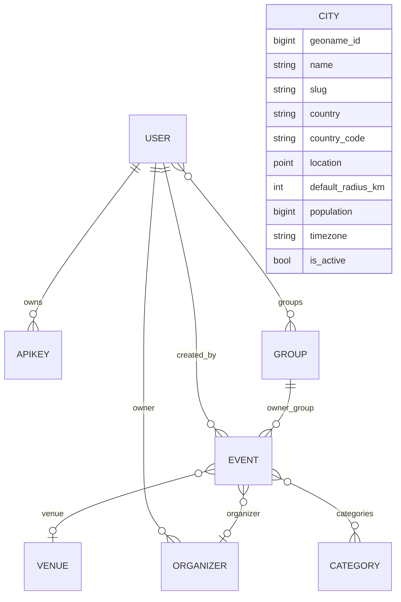

# Data model

The core domain is **events** that happen at **venues**, are hosted by **organizers**, and
are tagged with **categories**. Events and venues carry a **geographic location**
(PostGIS `Point`). A **city** gazetteer supports location-based discovery, and **users** /
**API keys** handle authentication and ownership.

## Entity-relationship diagram

> `City` is independent of the event graph — it is a gazetteer used to resolve
> `?near_city=<slug>` to a centroid + radius (see [Geospatial & cities](geospatial.md)).

## Event

A meetup or local event.

| Field | Type | Notes |
| --- | --- | --- |
| `id` | BigAutoField | PK |
| `title` | CharField(200) | |
| `description` | TextField | blank allowed |
| `starts_at` | DateTimeField | indexed (asc + desc) |
| `ends_at` | DateTimeField | nullable |
| `venue` | FK → Venue | nullable (SET_NULL) |
| `organizer` | FK → Organizer | nullable (SET_NULL) |
| `categories` | M2M → Category | blank allowed |
| `capacity` | PositiveIntegerField | nullable |
| `location` | PointField (geography, SRID 4326) | nullable; centroid for proximity |
| `created_by` | FK → User | nullable (SET_NULL); the owner |
| `owner_group` | FK → auth.Group | nullable (SET_NULL); co-owners |
| `created_at` | DateTimeField | auto |
| `updated_at` | DateTimeField | auto |

The API accepts `latitude`/`longitude` (write-only) and stores them as `location`; if a
`venue` with a location is set and no coords are given, the event copies the venue's
location. A GiST spatial index on `location` is created automatically by the PostGIS
backend.

## Venue

A physical place where events happen.

| Field | Type | Notes |
| --- | --- | --- |
| `id` | BigAutoField | PK |
| `name` | CharField(200) | |
| `address` | CharField(255) | blank |
| `city` | CharField(100) | free text (used by `?city=` exact filter) |
| `location` | PointField (geography, SRID 4326) | nullable |
| `capacity` | PositiveIntegerField | nullable |

## Organizer

A person or group that hosts events.

| Field | Type | Notes |
| --- | --- | --- |
| `id` | BigAutoField | PK |
| `name` | CharField(200) | |
| `description` | TextField | blank |
| `website` | URLField | blank |
| `owner` | FK → User | nullable (SET_NULL) |

## Category

A tag/group for events (e.g. "Music", "Tech").

| Field | Type | Notes |
| --- | --- | --- |
| `id` | BigAutoField | PK |
| `name` | CharField(80) | unique |
| `slug` | SlugField(80) | unique; auto-generated from `name` |

## City (gazetteer)

A readable catalog of populated places for location-based discovery.

| Field | Type | Notes |
| --- | --- | --- |
| `id` | BigAutoField | PK |
| `geoname_id` | PositiveBigIntegerField | unique, nullable; idempotency key for re-seeding |
| `name` | CharField(200) | proper name (may include accents) |
| `slug` | SlugField(220) | unique; used as `?near_city=` |
| `country` | CharField(100) | full name |
| `country_code` | CharField(2) | ISO 3166-1 alpha-2; indexed |
| `location` | PointField (geography, SRID 4326) | centroid |
| `default_radius_km` | PositiveIntegerField | default 15; suggested search radius |
| `population` | PositiveBigIntegerField | nullable; for ordering |
| `timezone` | CharField(50) | |
| `is_active` | BooleanField | default true; inactive cities are hidden |

Seeded with **2131 European cities ≥ 50 000 population** via `python manage.py
seed_cities`. See [Geospatial & cities](geospatial.md).

## User

Custom user (`accounts.User`, extends `AbstractUser`).

| Field | Type | Notes |
| --- | --- | --- |
| (AbstractUser fields) | — | username, password (hashed), email, is_staff, … |
| `is_service_account` | BooleanField | marks a non-interactive system client |
| `description` | TextField | blank |

Users carry Django **groups** and **permissions** uniformly, whether they are humans or
service accounts. See [Authentication](authentication.md).

## APIKey

A long-lived API key ("app secret") tied to a user.

| Field | Type | Notes |
| --- | --- | --- |
| `id` | BigAutoField | PK |
| `user` | FK → User | CASCADE; related name `api_keys` |
| `name` | CharField(120) | label |
| `prefix` | CharField(16) | public, indexed; identifies the key |
| `hashed_key` | CharField(64) | sha256 hex; compared in constant time |
| `created` | DateTimeField | auto |
| `revoked` | BooleanField | revocation flag |
| `expires_at` | DateTimeField | nullable |

The raw key is shown **only once** at creation; only the sha256 hash is stored.