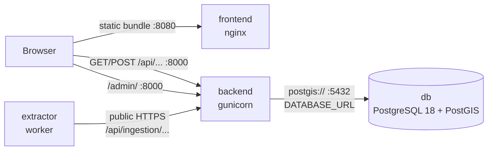

# Deploying on a container hoster

This is the complete guide for running the four terminschleuder containers on a
hoster that has **no docker compose** — either an app-platform-style UI (deploy
by image, per-container env panel, no docker network) or a plain host where you
run `docker run` yourself. For local development with compose, see the
[README](../README.md).

If you read nothing else: there are **four containers**, only **one of them
needs to reach another one** (the backend → the database), and the exact env-var
list per container is in the [per-container reference](#per-container-reference)
below.

## Topology — who talks to whom



| Container | Image | Listens on | Persistent volume | Needs to reach |
| --- | --- | --- | --- | --- |
| db | `ghcr.io/terminschleuder/backend-db:<release-version>` | 5432 (don't publish) | `pgdata` at `/var/lib/postgresql/data` | nothing |
| backend | `ghcr.io/terminschleuder/backend:<release-version>` | 8000 | media at `/app/media` (optional) | the db |
| frontend | `ghcr.io/terminschleuder/frontend:<release-version>` | 8080 | none | nothing (the **browser** calls the backend) |
| extractor | `ghcr.io/terminschleuder/extractor:<release-version>` | none | state at `/app/state` (recommended) | the backend's **public URL** |

Two things that are easy to get wrong:

- The **frontend container never talks to the backend**. It serves static files;
  the *browser* then calls the backend's public URL directly (the API base URL
  is set in the frontend's Settings page, stored in the browser's localStorage).
  So the frontend needs no env var, no network link, no volume — and the
  **backend's CORS settings** are what allow the browser to call it (the default
  allows all origins).
- The **extractor needs no shared network either** — it calls the backend over
  the public HTTPS URL like any other API client. Only the **backend → db**
  connection is internal.

`<release-version>` is the CalVer tag of a GitHub release (e.g. `2026.6.0`) —
see each repo's Releases page. Always pin the db image by release version;
`latest` floats with a Postgres major bump (see the README's
"PostgreSQL major upgrades" section).

## Order of operations

```text
1. db        (nothing depends on you yet — start here)
2. backend   (waits for the db, migrates, bootstraps; verify before continuing)
3. frontend  (independent — but verify the backend first so you can set the API URL)
4. extractor (last: needs an API key minted in the backend's admin first)
```

### 1. Database

**Image:** `ghcr.io/terminschleuder/backend-db:<release-version>`

| Env var | Meaning |
| --- | --- |
| `POSTGRES_USER` | DB user — **must match the user in the backend's `DATABASE_URL`** |
| `POSTGRES_PASSWORD` | DB password — **must match the password in `DATABASE_URL`** |
| `POSTGRES_DB` | DB name — **must match the database in `DATABASE_URL`** |

- **Volume:** mount one at `/var/lib/postgresql/data` — this is all of your data.
- **Port:** none published. The backend reaches the db through the platform's
  internal service name (UI hosters) or a shared docker network (plain hosts),
  never through a public port.
- **What you should see:** the container starts and stays up. On a plain host:

```bash
docker network create ts-net
docker run -d --name ts-db --network ts-net --restart unless-stopped \
  -v ts-pgdata:/var/lib/postgresql/data \
  -e POSTGRES_USER=terminschleuder -e POSTGRES_PASSWORD=<db-password> -e POSTGRES_DB=terminschleuder \
  ghcr.io/terminschleuder/backend-db:<release-version>
```

On a UI hoster: create the container with the same env values, attach a volume
at `/var/lib/postgresql/data`, and **note the internal service name** the
platform gives it (often the app/component name) — the backend's
`DATABASE_URL` host must be exactly that name.

### 2. Backend

**Image:** `ghcr.io/terminschleuder/backend:<release-version>` · **Port:** `8000`

Required env — nothing has a safe default:

| Env var | Value |
| --- | --- |
| `SECRET_KEY` | a long random string — generate one: `openssl rand -hex 32` |
| `ALLOWED_HOSTS` | your backend domain(s), comma-separated, e.g. `www.terminschleuder.online`. **Empty default rejects every request with a 400** |
| `DATABASE_URL` | `postgis://<user>:<password>@<db-host>:5432/<dbname>` — the same credentials you gave the db container; the host is the db's internal service name (UI hoster) or container name (`ts-db` on the shared network) |

Conditional env — set these depending on your domain and setup:

| Env var | When you need it |
| --- | --- |
| `CSRF_TRUSTED_ORIGINS` | **Required on any domain other than terminschleuder.online** (the default trusts only that domain + `www` + subdomains) — without it every admin/POST action fails the CSRF check. e.g. `https://app.example.com` |
| `CORS_ALLOW_ALL_ORIGINS=False` + `CORS_ALLOWED_ORIGINS` | Recommended once you know the frontend's origin — restrict the API to your own site. Default: all origins allowed (fine for a public read-only API) |
| `DJANGO_SUPERUSER_USERNAME` / `_PASSWORD` / `_EMAIL` | First-boot operator login. The entrypoint's `bootstrap` creates the superuser on a fresh DB; on restarts it never overwrites it |
| `SERVE_MEDIA=False` | Only if a CDN/proxy serves `/media/` instead of the backend |
| `DJANGO_JWT_SIGNING_KEY` | Optional: a separate key for JWT signing (defaults to `SECRET_KEY`) |

- **Volume (optional but recommended):** one at `/app/media` for event hero
  images — without it, uploads vanish on redeploy. If you bind-mount a host path
  instead of a named volume, it must be owned by uid 1001.
- **Health check:** `GET /api/schema/` → `200`. Use it as the platform's HTTP
  health check / "the app is up" probe.
- **What you should see (first boot):** startup is slower than usual — the
  entrypoint waits for the db, runs migrations, then `bootstrap` (superuser,
  `ingestion` group, 2131-city gazetteer). Look for `[entrypoint] Bootstrap
  complete` in the logs. If the db isn't reachable the entrypoint retries for
  ~1 minute, then exits instead of serving against an unverifiable schema —
  that means `DATABASE_URL` (or the db's service name) is wrong.
- **Verify before continuing:**
  - `https://<your-backend>/api/schema/` → 200
  - `https://<your-backend>/api/cities/` → JSON list, 2131 cities
  - `https://<your-backend>/admin/` → login works with the bootstrapped superuser

```bash
docker run -d --name ts-web --network ts-net --restart unless-stopped \
  -p 8000:8000 -v ts-media:/app/media \
  -e SECRET_KEY=$(openssl rand -hex 32) \
  -e ALLOWED_HOSTS=www.terminschleuder.online \
  -e CSRF_TRUSTED_ORIGINS=https://www.terminschleuder.online \
  -e DATABASE_URL=postgis://terminschleuder:<db-password>@ts-db:5432/terminschleuder \
  -e DJANGO_SUPERUSER_USERNAME=admin -e DJANGO_SUPERUSER_PASSWORD=<password> -e DJANGO_SUPERUSER_EMAIL=you@example.com \
  ghcr.io/terminschleuder/backend:<release-version>
```

### 3. Frontend

**Image:** `ghcr.io/terminschleuder/frontend:<release-version>` · **Port:** `8080`

- **Env: none. The env panel can stay empty.** The runtime API URL is set
  **in the browser** (Settings page, stored in localStorage) — the same image
  works against any backend.
- **Volume:** none. **No link to the backend container is needed** (see topology).
- **Route:** publish port `8080` as the container's HTTP port.
- **Verify:** the page loads, then open Settings and point the API base URL at
  your backend (`https://<your-backend>`) — the event list should fill in.

```bash
docker run -d --name ts-app --restart unless-stopped -p 8080:8080 \
  ghcr.io/terminschleuder/frontend:<release-version>
```

### 4. Extractor (and its API key)

The extractor runs headless: it polls approved sources, extracts event data
with an LLM, and submits it to the backend's **public** ingestion API — it needs
an API key minted in the backend's admin, so it can only be set up after the
backend is running and you can log into `/admin/`.

**Onboarding (one-time, works on any hoster — no exec needed):**

1. Log into `https://<your-backend>/admin/` with the bootstrapped superuser.
2. Create the service account `extractor` in the `ingestion` group
   (backoffice → service accounts; the group carries its permission set).
3. Mint an API key for it — **the raw key is shown exactly once**.
4. Put that key into the extractor's env as `EXTRACTOR_API_KEY`.

(On a host with `docker run`, the backend README also documents a one-off
container variant using `create_service_account` — the admin path above is the
same result and works everywhere.)

**Image:** `ghcr.io/terminschleuder/extractor:<release-version>` · **Port:** none

Required env (see the
[extractor README](https://github.com/Terminschleuder/extractor#configuration)
for the full list and defaults):

| Env var | Value |
| --- | --- |
| `EXTRACTOR_API_KEY` | the key minted above |
| `EXTRACTOR_API_BASE_URL` | your backend's public base URL, e.g. `https://www.terminschleuder.online` — **the default is the production URL**, so change it for any other deployment |
| `EXTRACTOR_LLM_BASE_URL` | your LLM endpoint — **the default `http://localhost:11434/v1` (Ollama) is unreachable from inside a container** |
| `EXTRACTOR_LLM_MODEL` | the model name your endpoint serves (default `llama3.1`) |
| `EXTRACTOR_LLM_API_KEY` | your LLM endpoint's key (default `ollama`) |
| `EXTRACTOR_STATE_FILE` | **recommended:** `/app/state/crawl_state.json`, with a volume at `/app/state` — without it, crawl timestamps are lost on redeploy and sources get re-crawled |

```bash
docker run -d --name ts-extractor --restart unless-stopped \
  -v ts-state:/app/state \
  -e EXTRACTOR_API_KEY=<key> \
  -e EXTRACTOR_API_BASE_URL=https://www.terminschleuder.online \
  -e EXTRACTOR_LLM_BASE_URL=https://<llm-endpoint>/v1 \
  -e EXTRACTOR_LLM_MODEL=<model> -e EXTRACTOR_LLM_API_KEY=<llm-key> \
  -e EXTRACTOR_STATE_FILE=/app/state/crawl_state.json \
  ghcr.io/terminschleuder/extractor:<release-version>
```

Nothing is extracted until a source is approved — approve one in the admin
(see the [user manual](user-manual.md)), then watch the extractor's logs for a
run reporting observations to the ingestion API.

## Per-container reference

The tables above are the deploy-time shortlist. The complete env surface:

- **backend:** README → [Configuration](../README.md#configuration) (all
  `SECRET_KEY`/`ALLOWED_HOSTS`/`CSRF`/`CORS`/`DATABASE_URL`/`SERVE_MEDIA`/
  `DJANGO_SUPERUSER_*`/`DJANGO_JWT_SIGNING_KEY` vars with defaults)
- **frontend:** none at runtime (build-time `VITE_*` vars are baked into the image)
- **extractor:** extractor README → Configuration (all `EXTRACTOR_*` vars)
- **db:** only `POSTGRES_USER/PASSWORD/DB`

## Updating to a new release

1. Note the new `<release-version>` from the repo's Releases page.
2. Redeploy each container with the new pinned tag. The backend's entrypoint
   re-runs migrate + `bootstrap` idempotently — no manual steps.
3. **Never** bump the db image across a Postgres major (e.g. 18 → 19) this way —
   that is a breaking data change; follow the README's
   "PostgreSQL major upgrades" runbook first.

## Troubleshooting quick hits

- **Every backend request returns 400** → `ALLOWED_HOSTS` not set.
- **Backend log: DB retry loop, then exit** → `DATABASE_URL` wrong, or the db's
  internal service name doesn't match the host part of `DATABASE_URL`.
- **Admin/POST actions fail with a CSRF error** → your domain isn't in
  `CSRF_TRUSTED_ORIGINS` (only terminschleuder.online is trusted by default).
- **Frontend loads but no data** → API base URL in the browser Settings points
  at the wrong backend, or the backend's CORS settings changed.
- **Extractors re-crawl everything after a restart** → `EXTRACTOR_STATE_FILE`
  unset, or no volume at `/app/state`.